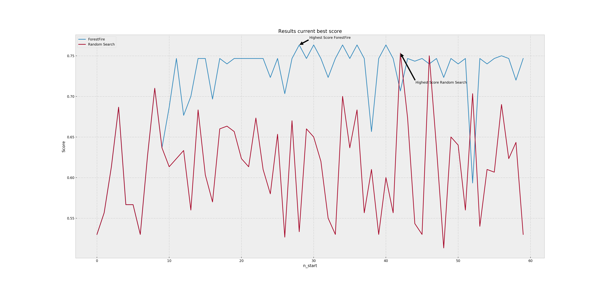
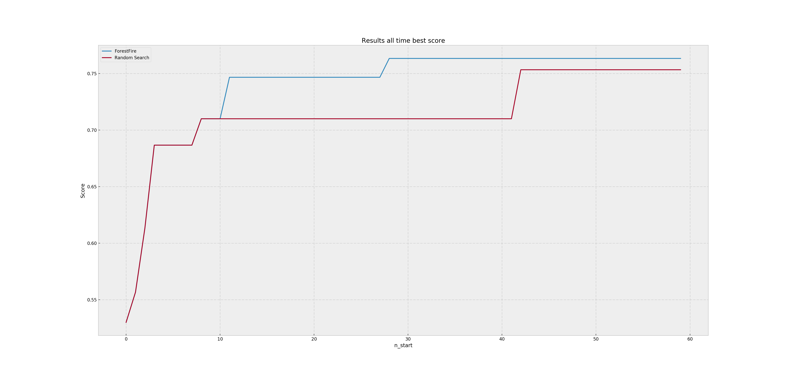

Evaluation Mode
===============

If the :ref:`hyperparameter <hyperparameters>` *demo_mode* is set to *True* the performance of ForestFire can be compared to a randomized search of new feature sets. 
Information about the performance is printed out after both ForestFire and the randomized search are done.

If *plot_enable* is set to *True*, the performance of both are plotted over the number of generated feature sets. 
Example Plots may look like this:

For every new feature set that gets calculated with ForestFire a randomly generated feature set is calculated.

.. important::

    **Functions used in this chapter**

    .. autofunction:: ForestFire.Main.main_loop
        :noindex:

